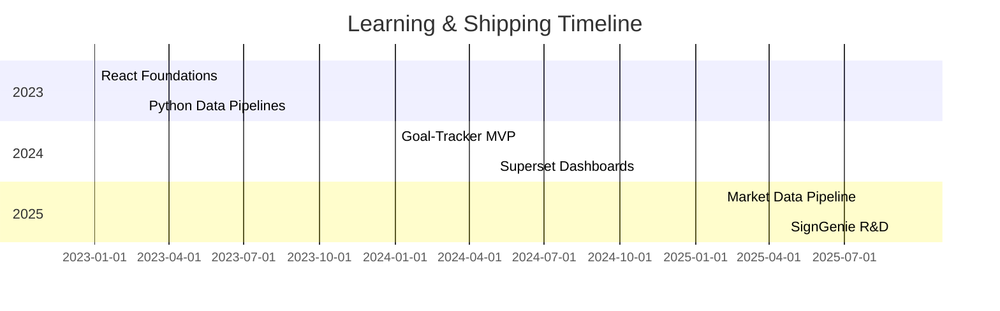

# **Aathira • Builder. Learner. Maker.**

 

> **Bridging ideas → shipped products with code, data & relentless curiosity.**

---

## 📜 TL;DR

| Current Focus                                            | Tech Arsenal                                                         | Looking For                                            |
| -------------------------------------------------------- | -------------------------------------------------------------------- | ------------------------------------------------------ |
| 🚀 Full‑stack app patterns & cloud‑native data pipelines | TypeScript · React19 · Python · Airflow · Snowflake · Supabase · AWS | 🌍 Open‑source collabs · Mentorship · Cool side quests |

---

## 🧭 Signature Work

|          | Name & Demo                                                                                                                          | One‑liner                                            | Core Stack                                |
| -------- | ------------------------------------------------------------------------------------------------------------------------------------ | ---------------------------------------------------- | ----------------------------------------- |
| ✨ **1**  | **[Goal‑Tracker](https://github.com/AathiraTD/Goal-Tracker)** Next-gen habit tracker (monorepo)                       | Real‑time **goals → insights** in a single Turborepo | Next.js 15 · Supabase · tRPC · Tailwind 4 |
| ⚡ **2**  | **[Realtime Market Data Pipeline](https://github.com/AathiraTD/realtime-market-data-pipeline)** Sub‑hour FTSE/FX feed | 18k rows/run → live Snowflake → Superset             | Airflow · Snowflake · Superset · Docker   |
| 🤟 **3** | **[SignGenie](https://github.com/AathiraTD/SignGenie)** Sign → speech in <300 ms                                      | YOLO hands + Transformer sequence ≈ magic            | PyTorch · FastAPI · MLflow · ECS          |

📂 Deep‑dive Highlights

| Project         | Hardest Problem                           | Clever Fix                                                      |
| --------------- | ----------------------------------------- | --------------------------------------------------------------- |
| Goal‑Tracker    | **Monorepo drift** with multiple packages | Turbo + pnpm *workspaces:* every PR runs selective builds/tests |
| Market Pipeline | **Snowflake bill spikes** during peak     | Auto‑suspend warehouse (60 s) + SLA‑aware Airflow sensors       |
| SignGenie       | **Latency** crossing 500 ms               | Quantised ONNX + CUDA graph capture → 280 ms end‑to‑end         |

---

## 🛠 Skill Matrix

| Area               | Tools                                  | Recent ⚙️                                    |
| ------------------ | -------------------------------------- | -------------------------------------------- |
| **Frontend**       | React • Next.js • Tailwind • Storybook | React Server Components, Partial Hydration   |
| **Backend**        | FastAPI • tRPC • Node • Supabase       | TRPC‑on‑Edge Runtimes                        |
| **Data Eng**       | Airflow • dbt • Snowflake              | Dynamic task mapping, cost‑aware warehousing |
| **ML & CV**        | PyTorch • YOLO • MLflow                | ONNX runtime, NVIDIA TensorRT                |
| **Dev Experience** | Turborepo • pnpm • GitHub Actions      | Monorepo selective CI                        |

---

## 📈 Journey Snapshot

---

## 🤝 Let’s Connect

| Platform | Link                          |
| -------- | ----------------------------- |
| LinkedIn | <!-- TODO: add URL -->        |
| Twitter  | <!-- TODO: @handle -->        |
| Email    | <!-- TODO: your@email.com --> |

> *“The best way to predict the future is to invent it.” — Alan Kay*

  ⭐ Feel free to star projects, open issues, or just say hi!

